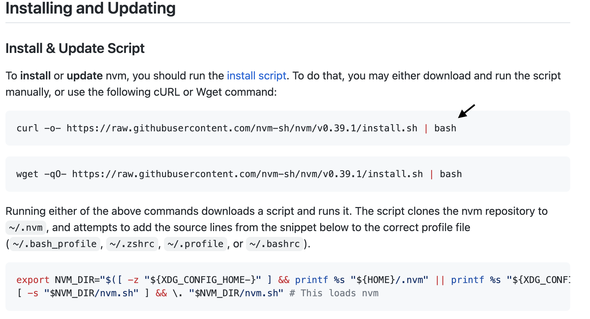
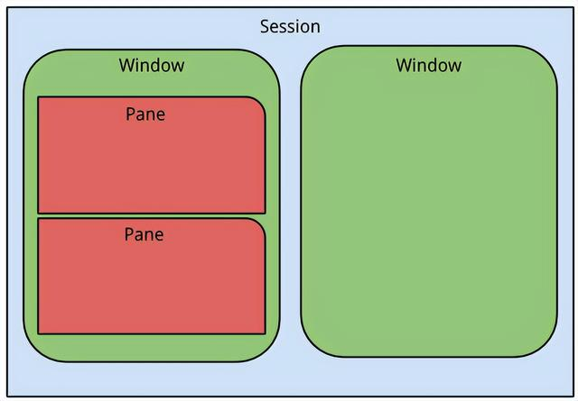

> Mac 电脑由于其 MacOS 系统、触摸板、体积等一系列原因在程序员中广受欢迎，在这里就简单分享下前端工程师的 Mac 开发使用技巧。

<br/>

# **1 Mac 基础技巧**
### **1.1 Mac 常用快捷键**
```
// 访达
Command + Shift + 3                // 截取全屏到桌面
Command + Shift + 4                // 截取所选区域到桌面
Command + Shift + N                // 新建文件夹
Command + Shift + .                // 显示/隐藏 隐藏文件
Command + Shift + G                // 调出窗口，可输入绝对路径直达文件夹
Command +  C                       // 复制文件
Command +  V                       // 粘贴文件
Command + Option + V               // 剪切文件，需要先复制文件
Command + Option + C               // 复制选中文件的路径

// 浏览器
Command + L                        // 光标直接跳至地址栏
Command + T                        // 打开一个新标签页
Command + 数字键 N                  // 切换到第 N 个标签页
Command + '+-'                     // 放大/缩小页面
Command + 左右箭头                  // 返回上一页或者下一页
Control + Tab                      // 转向下一个标签页
Control + Shift + Tab              // 转向上一个标签页

// 应用程序
Command + H                        // 隐藏非全屏的应用程序
Command + W                        // 关闭当前应用窗口
Command + Q                        // 完全退出当前应用
Command + N                        // 新建当前应用窗口
Command + ,                        // 打开当前应用的偏好设置
Command + 空格						// 打开聚焦搜索
Command + Option + esc             // 打开强制退出的窗口
Command + control + F              // 应用全屏
Command + control + 空格            // 打开表情符号选择界面

// 其他
Command + control + Q              // 锁定屏幕
option  + 空格						// 打开你安装的UTools
```
更多快捷键[参考](https://support.apple.com/zh-cn/HT201236)

### **1.2 触发角**
有时需要快速打开启动台、调度中心、应用程序窗口，可以使用快捷键做到，也可以设为mac的触发角动作。打开**系统偏好设置-桌面与屏幕保护程序-屏幕保护程序-触发角**，就可以设置触发角动作，比如左上角鼠标划过就打开控制台，右下角划过就锁定屏幕，非常便捷。


<br/>

# **2 Mac前端开发环境搭建**
### **2.1 基本配置**
#### **2.1.1 Git**
> Git 是一个开源的**分布式版本控制系统**，可以有效、高速地处理从很小到非常大的项目版本管理。

**1.安装Git**

* [官网下载](https://git-scm.com/download/mac)
* 通过brew命令安装：`brew install git`

**2.配置基础信息和SSH**

* 设置username和email
```
git config --global user.name "username"
git config --global user.email "email"
```
* 生成密钥
```
// 首先检查电脑是否曾经生成过秘钥
cd ~/.ssh   // 若打开该文件夹为空，则表示没有生成过秘钥，进入第二步。（~表示根目录）

// 生成密钥
ssh -keygen -t rsa -C "sevenXXX@163.com"

// 接着默认一直回车
// 执行成功后，会在主目录.ssh路径下生成两个文件：id_rsa私钥文件；id_rsa.pub公钥文件

// 检查SSH是否生成成功
cat ~/.ssh/id_rsa.pub

// 将上述结果复制到github - settings - SSH and GPG keys - New SSH key 即可

// 验证是否成功
ssh -T git@github.com
```

#### **2.1.2 Node + nvm**

**1.nvm**
> Node Version Manager(nvm)是**node版本管理工具**，使用nvm已经是Nodejs开发者必备的工具，它最大的用途在于可以轻松切换不同版本的Nodejs，帮助团队统一开发环境，避免版本问题引发的错误。

（1）卸载node

若电脑已经安装node，需要卸载掉，检查是否安装node。
```
node -v
```
如果有版本返回，说明电脑已经安装node，此时需要把node卸载掉，若未安装node忽略以下操作。
```
// 依次执行
sudo npm uninstall npm -g
sudo rm -rf /usr/local/lib/node /usr/local/lib/node_modules /var/db/receipts/org.nodejs.*
sudo rm -rf /usr/local/include/node /Users/$USER/.npm
sudo rm /usr/local/bin/node
sudo rm /usr/local/share/man/man1/node.1
sudo rm /usr/local/lib/dtrace/node.d

// 验证是否卸载完成
node  -v
npm  -v
```

或者手动删除
* NODE_MODULES or NODE 文件夹（位于您的 /usr/local/lib)
* NODE-GYP 文件夹（位于您的 /usr/local/bin)
* NODE 文件夹（位于您的 /usr/local/bin)
* NODE-DEBUG 文件夹（位于您的 /usr/local/bin)
* NODE 文件夹（位于您的 /usr/local/include)
* NODE_MODULES 文件夹（位于您的 /usr/local/include)
* NPM （位于您的主目录中）
* NODE-GYP （位于您的主目录中）
* NODE 文件夹（位于您的 /opt/local/include)
* NODE 文件夹（位于您的 /opt/local/bin/)
* NODE 文件夹（位于您的 /usr/local/share/doc/)
* NODE_MODULES 文件夹（位于您的 /opt/local/lib/)
* NODE_REPL_HISTORY （位于您的主目录中）
* STP （位于您的 /usr/local/share/systemtap/tapset/)
* D （位于您的 /usr/local/lib/dtrace/)
* NPM* （位于您的 /usr/local/share/man/man1)
* NODE* （位于您的 /usr/local/share/man/man1)
* .NPMRC （位于您的主目录中）——如果您想在卸载后立即重新安装 Node.js，则不应删除该文件。


（2）安装git

（3）安装nvm

打开[链接](https://github.com/nvm-sh/nvm#install--update-script):在下面的简介中找到install这几个字，然后继续往下找，直到找到


<br/>
复制箭头所指的字到终端执行会就安装nvm

**注意：安装完成后，还暂时不能用，需要复制它提示的代码来配置环境变量，如**
```
// 编辑.zshrc
vim .zshrc

// 再最后加入
export NVM_DIR="$HOME/.nvm"
[ -s "$NVM_DIR/nvm.sh" ] && \. "$NVM_DIR/nvm.sh"  # This loads nvm
[ -s "$NVM_DIR/bash_completion" ] && \. "$NVM_DIR/bash_completion"  # This loads nvm bash_completion

// 使其生效
source ~/.zshrc
```
最后进行测试： `nvm`

（4）nvm常用指令
```
nvm version 查看当前的版本
nvm install 安装最新版本nvm
nvm install <version>  安装相应版本
nvm use <version>  切换使用指定的版本node
nvm ls 列出所有版本
nvm current显示当前版本
nvm uninstall <version> 卸载制定的版本
```

**2.nvm和n的比较**
* n: 全局安装的npm package。使用npm install -g n安装，与node循环依赖。
* n 命令是作为一个 node 的模块而存在，而 nvm 是一个独立于 node/npm 的外部 shell 脚本，因此 n 命令相比 nvm 更加局限。
* 由于 npm 安装的模块路径均为 /usr/local/lib/node_modules，当使用 n 切换不同的 node 版本时，实际上会共用全局的 node/npm 目录。 因此不能很好的满足按不同 node 版本使用不同全局 node 模块的需求。

**3.node**
> Nodejs 是一个基于 Chrome V8 引擎的 JavaScript 运行环境；使用一个事件驱动、非阻塞I/O的模型，使其轻量且高效；Nodejs的软件包生态系统npm是全球最大的开源库生态系统。

（1）下载Nodejs

* [官网下载](https://nodejs.org/en/)
* 用nvm下载：`nvm install <version>`

安装完成后可以在终端输入 `node -v` 和 `npm - v`验证是否安装成功

（2）设置npm淘宝镜像源

```
// 设置
npm config set registry https://registry.npm.taobao.org

// 验证
npm config list
```

#### **2.1.3 编辑器**
* Sublime Text
* PhpStorm
* Visual Studio Code
* Atom

本人选择 [vscode](https://code.visualstudio.com/download) 👍


#### **2.1.4 Chrome**
> chrome 浏览器是前端开发必不可少的软件，除此之外还有 Firefox 和 Safari 浏览器同样重要。

* [下载地址](https://www.google.com/intl/zh-CN/chrome/)

#### **2.1.5 抓包工具 charles**
> 好用的抓包工具，基本功能包括抓包、断点调试、请求替换、构造请求、代理功能，方便移动端调试。
* [下载地址](https://www.charlesproxy.com/download/)
* [【教程】安装配置charles](https://www.cnblogs.com/strengthen/p/12200080.html)

<br/>

### **2.2 进阶配置**

#### **2.2.1 iterm2**

**1.问题**

Mac支持原生Shell，其自带的Terminal终端存在一定的缺陷（浅喻：ie）。

**2.作用**

iterm2是一款功能强大的**命令行应用/终端工具**，通常用于替代Terminal。
* 选中即复制，无需command＋c
* 全文查找并高亮显示：command＋f
* 垂直分屏：command＋d
* 水平分屏：command＋shift＋d 
* 等等

**3.相关链接**

* [下载地址](https://iterm2.com/)
* [官方文档](https://iterm2.com/documentation.html)

#### **2.2.2 zsh & oh-my-zsh**

**1.作用**

zsh是shell语言类型，兼容bash，提供强大的命令行功能，但是配置复杂。
而oh-my-zsh是一个开源的框架，用于管理和简化zsh配置。

**2.相关链接**

* [下载地址](https://ohmyz.sh/)
* [【操作】item2 + oh-my-zsh 终端配置](https://juejin.cn/post/6894432073491152910)

#### **2.2.3 Homebrew（brew）**

**1.作用**

* Homebrew 是基于 OS X 的**套件管理工具**，是一个开源的 Ruby 脚本，专门用于快速下载软件。更通俗地讲，Homebrew 类似于一个软件中心，可以理解成 App Store 或者 Google Play 那样的软件商店，只不过Homebrew 比前者以及 Mac App Store 来说有着更丰富的资源与更高效的管理。
* Homebrew Cask 是一套建立在 Homebrew 基础之上的 OS X 软件安装命令行工具，是 Homebrew 的扩展，可以把 Homebrew Cask 当作是 Homebrew 的一部分，在安装常用软件的过程中，大部分情况下只需要使用 Homebrew Cask 就足够了。

**2.安装**

```
ruby -e "$(curl -fsSL https://cdn.jsdelivr.net/gh/ineo6/homebrew-install/install)"
```

**3.对比**

* brew主要用来下载一些不带界面的命令行下的工具和第三方库来进行二次开发
* brew cask主要用来下载一些带界面的应用软件，下载好后会自动安装，并能在mac中直接运行使用

```
// 举例
brew install curl可以安装curl第三方库，这样你在开发时就可以使用它的库来进行开发
brew cask install chrome可以安装谷歌浏览器应用程序，可直接运行
```

#### **2.2.4 tmux**

**1.问题**

一般情况下，当你需要在远程服务器上同时进行多项任务，我们可以在命令后面加上&来同时运行多条命令。但是当你想要同时监视每个任务的时候，这就不可行了。又或者可以开多个窗口，来分别执行任务，但是对于不同的窗口，还需要重新SSH连接到远程服务器，大大降低了工作效率，当你桌面上窗口太多的时候，也可能会在找哪个窗口进行哪个任务上浪费大量时间。

**2.作用**

tmux是一个开源且功能非常强大的**终端多路复用器**，用于类Unix操作系统。
* 允许在单个窗口中同时访问多个会话
* 可以让新窗口“接入”已经存在的会话
* 允许每个会话有多个连接窗口
* 支持窗口任意的垂直和水平拆分

**3.概念关系**

Server：是整个tmux的后台服务<br/>
Session：是tmux的所有会话<br/>
Window：相当于一个工作区，包含很多分屏<br/>
Pane：Window里面的小分屏<br/>



**4.相关链接**

* [【教程】Tmux使用教程](https://www.ruanyifeng.com/blog/2019/10/tmux.html)
* [【教程】Tmux配置](https://www.cnblogs.com/zuoruining/p/11074367.html)

#### **2.2.5 dotfile**

**1.作用**

dotfiles是以 . 为前缀的文件的统称，在Mac OS X或Linux这类系统中，在工作环境中这类文件是作为隐藏文件展示的，无法看到（如：.vimrc\.bashrc\.bash_profile等）。它们通常用来存储一些个人化的设定或是自定的拓展功能，以符合使用者本身的实用需求与习惯，从而提升自身的工作效率。dotfiles一般用于软件设置，可以通过备份dotfiles的方式来**同步软件设置**。

**2.相关链接**

*[【教程】dotfiles新手教程](https://www.jianshu.com/p/7UJapk/)

#### **2.2.6 mackup**

**1.作用**

Mackup是Github 上的开源项目，旨在快速方便地**备份恢复软件的配置文件**。

**2.使用**

```
// 安装Mackup
brew install mackup

// 设置同步文件夹
vim ~/.mackup.cfg # 进行配置
[storage]
engine = file_system	# 表示用文件系统进行存储

// Mackup操作
mackup backup	# 备份命令
mackup restore	# 数据恢复
mackup list # 查看支持的软件列表
makeup -h # 帮助命令
mackup uninstall # 将配置文件拷回原来的系统目录
```

**3.相关链接**

* [【教程】使用 Mackup 快速备份 Mac 软件的配置文件](https://sspai.com/post/32933)

#### **2.2.7 ncu**

**1.问题**

npm update，只能按照package.json中标注的版本号进行更新，升级后不会修改package.json中的版本号，需要自己手动修改，比较麻烦。

**2.作用**

npm-check-updates（ncu）是**npm模块升级工具**，可以在插件升级后会自动修改package.json里的版本号，简单方便。

**3.相关链接**

* [官方网址](https://www.npmjs.com/package/npm-check-updates)
* [【教程】白话版ncu使用手则](https://www.cnblogs.com/vickylinj/p/12230374.html)

#### **2.2.8 xcode command line tools**

**1.问题**

Xcode是**在命令行上运行**的软件开发人员的工具，即在终端应用程序（也称为控制台）中运行。开箱即用的 Mac 并不包含编程所需的所有软件和工具。相反，Apple 为程序员提供了一个名为 Xcode 的完整开发环境，可以单独下载和安装。完整的 Xcode 包很大，需要超过 40GB 的磁盘空间，并且支持所有 Apple 操作系统的开发。许多软件开发人员，尤其是 Web 应用程序开发人员，都在使用 Mac，但并未为 Apple 设备开发软件。他们仍然需要与 Xcode 包一起安装的类 Unix 工具和实用程序。

**2.作用**

xcode command line tools 是Apple针对上述问题提供了一个单独的、更小的下载。它安装了软件开发最需要的实用程序，我们可以从终端应用程序安装这个较小的包，或者作为安装 Homebrew 的一部分。

**3.相关链接**

* [官方网址](https://mac.install.guide/commandlinetools/index.html)

#### **2.2.9 adb**

**1.作用**

Android Debug Bridge（adb），翻译过来叫**安卓调试桥，顾名思义就是连接Android设备和电脑的工具**。Android 平台的一些功能只能通过对普通用户隐藏的路径和方法来访问。这些通常是在一些命令行 adb 命令的帮助下完成的，这是 Google 为开发人员提供的一种工具。Android 调试桥 (adb) 是一种功能多样的**命令行工具**，可让您与设备进行通信。adb 命令可用于执行各种设备操作（例如安装和调试应用），并提供对 Unix shell（可用来在设备上运行各种命令）的访问权限，我们也可以将其用于各种整洁和隐藏的技巧。

**2.adb组成**

* 客户端：用于发送命令。客户端在开发机器上运行，可以通过发出 adb 命令从命令行终端调用客户端。
* 守护程序 (adbd)：用于在设备上运行命令。守护程序在每个设备上作为后台进程运行。
* 服务器：用于管理客户端与守护程序之间的通信。服务器在开发机器上作为后台进程运行。

**3.相关链接**

* [官方网站](https://developer.android.com/studio/command-line/adb)
* [【教程】Mac系统下adb入门](https://blog.csdn.net/and_then111/article/details/110233453)
* [【教程】adb常用命令](https://www.likecs.com/show-205141859.html)

<br/>

# **3 Mac 开发环境搭建过程遇到的问题**
### **3.1 git生成密钥使用报错**
现象：<font color=“red”>The authenticity of host 'github.com' can't be established.</font>

原因：少了一个known_hosts文件，本来密钥文件应该是三个，现在是两个，于是报错，此时选择yes回车之后即可，同时生成了缺少了的known_hosts文件。
```
Are you sure you want to continue connecting (yes/no)? //输入yes，回车
```

### **3.2 nvm安装成功但nvm命令没反应**

现象：<font color=“red”>在控制台输入nvm有结果但无法执行nvm的命令</font>

原因：配置clashx后只是系统代理而不是终端

解决方法：进行终端代理
* 在终端输入：vim .bash_profile
* 按“i”进入编辑模式，填写
```
function proxy_on() {
    export no_proxy="localhost,127.0.0.1,localaddress,.localdomain.com"
    export http_proxy="http://127.0.0.1:7890"
    export https_proxy=$http_proxy
    #export all_proxy=socks5://127.0.0.1:7890 # or this line
    echo -e "已开启代理"
}

function proxy_off(){
    unset http_proxy
    unset https_proxy
    echo -e "已关闭代理"
}
```
* 按“esc”退出编辑模式，“shift+zz”保存退出
* 在终端输入命令使其生效
```
source .bash_profile
```
* 开启/关闭代理
```
proxy_on
proxy_off
```

### **3.3 代理导致vscode拓展安装出错**

现象：<font color=“red”>在下载vscode拓展插件时显示“安装XXX拓展时出错。有关更多详细信息，请查看日志。请尝试手动下载”</font>

原因：电脑开了代理软件，只要把代理关掉就可以正常下载vscode插件。

### **3.4 iterm2权限问题引起的node配置发生错误**

现象：<font color=“red”>在iterm2进行node配置时出现错误：Error: EPERM: operation not permitted, scandir '/Users/xxx/.Trash'</font>

原因：iterm2权限不够

解决方法：“系统偏好设置”--“安全与隐私”--“隐私”

* “文件和文件夹”授予权限
* 打开“完全磁盘访问权限”

### **3.5 Mac每次重启都需要重新执行配置文件**

现象：<font color=“red”>每次开启终端都要执行 source ~/.bash_profile 配置的环境变量才生效</font>

原因：zsh加载的是 ~/.zshrc文件，而 ‘.zshrc’ 文件中并没有定义任务环境变量。

解决方法：在~/.zshrc文件最后增加
```
source ~/.bash_profile
```
