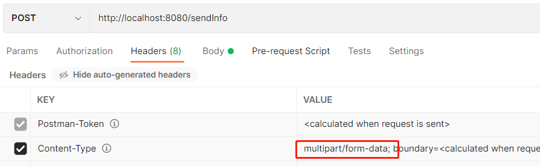

# **从熟悉的 axios 上手 Postman**

### **目录**
* 1.get 请求
* 2.post 请求
* 3.避免 400 状态码

## **一、get 请求**
> 一般 get 请求的传参是把参数包含在 URL 中。浏览器当前的实现是不允许 get 发送 body, 但后端应用可以发送，比如 nodejs 或 postman。前端不能使用 get 方法从浏览器里发送 body，get 请求携带参数一般采用 params 传参。

#### **（1） 在 axios 中发送 get 请求**
```
// 第一种方式
axios.get('/api/getInfo',{
  params:{
    name:"seven"
  }
}).then(res => {
  console.log(res)
})
   
// 第二种方式 直接连接（不推荐）
axios.get('/api/getInfo?name=seven',{
  params:{}
}).then(res => {
  console.log(res)
})
```
因为涉及到跨域问题，还需要在 vue.config.js 中做一个代理。
```
module.exports = {
  outputDir: "dist",
  assetsDir: "assets",
  lintOnSave: false,
  devServer: {
    open: true,
    host: "localhost",
    port: "8081",
    https: false,
    hotOnly: false,
    proxy: {
      // 当访问 /api/xxx 时会被代理到 http://localhost:8080/xxx
      "/api": {
        target: "http://localhost:8080", 
        ws: true,
        changeOrigin: true,
        pathRewrite: {
          "^/api": "",
        },
      },
    },
  },
};
```

#### **（2） 在 Postman 中发送 get 请求**

<br/>

## **二、post 请求**
> POST 请求的消息主体放在 body 中，服务端根据请求头中的 Content-Type 字段来获取消息主体的编码⽅式，进⽽进⾏解析数据，这里主要介绍比较常用的 3 种类型。

### **1 `application/x-www-form-urlencoded`**
> 最常见的 POST 提交数据的⽅式如果不设置 content-type 属性，默认为 application/x-www-form-urlencoded ⽅式提交数据，提交的表单数据会转换为键值对并按照 key1=val1&key2=val2 的⽅式进⾏编码，其中 key 和 val 都进⾏了 URL 转码。

#### **（1） 在 axios 中发送 post 请求 (application/x-www-form-urlencoded)**
```
// 第一种方式
// npm install qs --save 安装qs库
import qs from 'qs'
axios.post("/api/sendInfo", qs.stringify({
    name:'seven',
})).then((response) => {
    console.log(response.data);
});
   
// 第二种方式（不推荐）
axios.post("/api/sendInfo","name=seven").then((response) => {
  console.log(response.data);
});
```
#### **（2） 在 Postman 中发送 post 请求 (application/x-www-form-urlencoded)**

<br/>

在 postman 中选择 body 下的 x-www-form-urlencoded 请求头会自动变成 Content-Type:application/x-www-form-urlencoded，无需我们手动在去修改请求头。


<br/>

### **2 `multipart/form-data`** 
> 另⼀个常见的 POST 数据提交的⽅式，Form 表单的 Content-Type 设置为 multipart/form-data，它会将表单的数据处理为⼀条消息，以标签为单元，⽤分隔符分开。由于这种⽅式将数据有很多部分，它既可以上传键值对，也可以上传⽂件，甚⾄多个⽂件。

#### **（1） 在 axios 中发送 post 请求 (`multipart/form-data)**
axios 在传递 json 序列化参数的时候默认的请求头是 application/json，所以在请求类型是 multipart/form-data 的时候需要单独指定请求头，否则就会变成 application/json。

```
// 需要手动设置请求头
let data = new FormData();
data.append('name','seven');
let config = {
  headers: {
    'Content-Type': 'multipart/form-data'
  }
}
axios.post("/api/sendInfo", data, config).then((response) => {
    console.log(response.data);
});
```

#### **（2） 在 Postman 中发送 post 请求 (`multipart/form-data)**

<br/>

postman 中选择 body 下 form-data 请求头会自动变成 Content-Type:multipart/form-data，无需我们手动在去修改请求头。


<br/>


### **3 `application/json`**
> Content-Type: application/json 作为响应头⽐较常见。实际上，现在越来越多的⼈把它作为请求头，⽤来告诉服务端，消息主体是序列化后的 JSON 字符串，其中⼀个好处就是 JSON 格式⽀持⽐键值对复杂得多的结构化数据。

#### **（1） 在 axios 中发送 post 请求 (application/json)**
```
axios.post("/api/sendInfo", {
    name: "seven",
  })
  .then((response) => {
     console.log(response.data);
  });
```

#### **（2） 在 Postman 中发送 post 请求 (application/json)**

<br/>

在 postman 中选择 body 下的 row 右侧类型选择 JSON 请求头会自动变成 Content-Type:application/json, 无需我们手动在去修改请求头。

**注意：写内容的时候一定要是标准的 JSON 使用双引号。**


<br/>


### **注意**
如果有二进制（非字母数字）数据（或相当大的有效载荷）要传输，请使用 `multipart/form-data`，其他情况建议使用 `application/x-www-form-urlencoded` 或者 `application/json`。


## **三、避免 400 状态码**
很多时候接口调试得到 400 报错，很有可能就是传参设置不正确。出错时，不妨回过头来检查下是否格式正确。