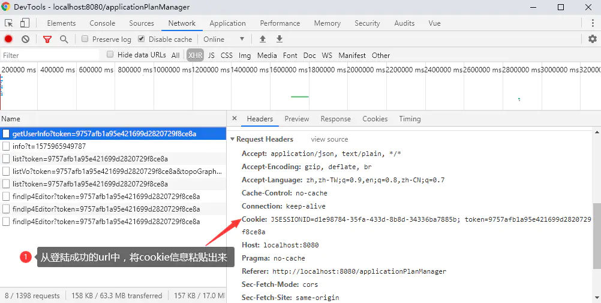
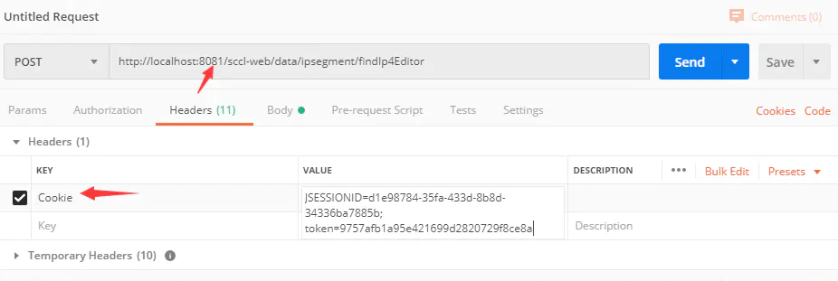
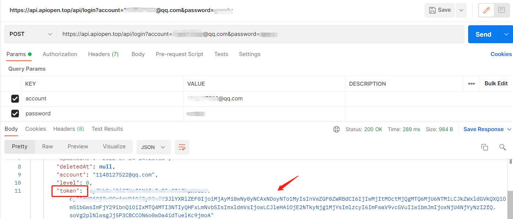
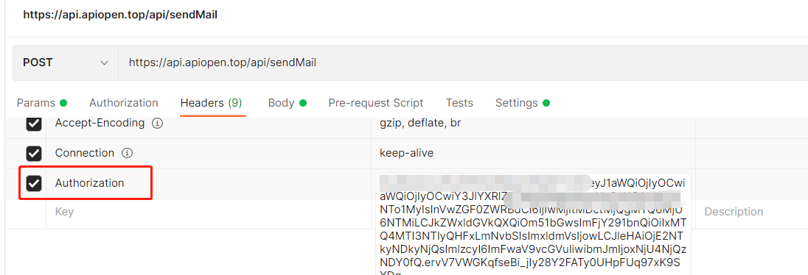
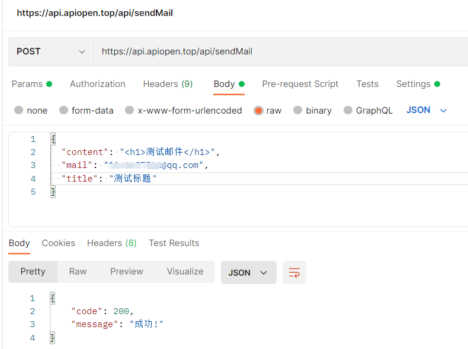

# **如何绕过登录鉴权直接测试后端接口**

### **目录**
* 1.回顾 cookie、session 和 token
* 2.携带 cookie 测试
* 3.携带 token 测试

## **一、回顾 cookie、session 和 token**
#### **（1） cookie**
cookie 是一段存储在**浏览器端**的文本数据，cookie 中的内容会随着 http 请求一起发送到服务器端。

#### **（2） session**
session 是存储在**服务器端**的一组数据，网站可以采取 session 的机制来验证用户身份，通常会把 sessionID 存储在 cookie 中。

#### **（3） token**
token 是一个字符串，token 的特点就是紧凑并且安全，它可以**存储在 cookie、localStorage 等里面**，有一种用户认证机制为 json web token（JWT），主要是在网络应用中传递一些小批量的安全的数据时使用。

#### **（4） 登录机制**
**a. Cookie-Session 机制**

用户输入用户名、密码后，后台服务在 session 中设置登录状态和用户的一些基本信息，然后将响应返回到浏览器，并设置 cookie。下次用户在这个浏览器中，再次访问服务时，请求中会带上这个 cookie，服务端根据这个 cookie 就能找到对应的 session，从 session 中取得用户的信息，从而维持了用户的登录状态。

**b. 利用用户验证机制 JWT+token**

JWT 主要分为三部分：header.preload.signature（x.y.z）。JWT 主要应用在身份认证，当用户登录系统之后，后台会返回一个 JWT 给浏览器端，用户只需要本地保存这个 token 即可。

 

token 通常存储在存储在 cookie、localStorage 里面（如果是 app，就是用自己的存储机制来存储），用户请求后台资源的时候每次都要带上 token，后台会对这个 token 进行验证。JWT 也可以用于信息交换，由于它的信息是经过签名的，可以确保发送的信息是真实的，因此可以用于小批量的数据交换。

服务端只要保证唯一密钥不丢失，每次都是临时通过 header 和 payload 配合密钥去生成 signature 验证用户身份的。其实最重要的也就是 signature，但是由于密钥只在服务端，如果本地 token 不泄露，其他人无法根据 header 和 payload 生成正确的 signature，也无法通过修改 payload 去假冒其他用户或者篡改该用户的其他信息。

**c. 对比**
* cookie + session：sessionid 是存在服务器内存里，session 保存的用户信息存在服务器内存或数据库，cookie 接收保存服务器发来的 sessionid，然后每次浏览器发送请求就会带上 cookie 的数据。 

* token（存储在 cookie 或 localstorage 中）+ JWT：token 生成于服务端（加密），存储在客户端，服务端不用存储，用户后面每次登录都携带首次都登录生成的 token 字符串用于验证，能做到这点，关键就是 token 使用的某种算法根据用户签名和其它一些信息生成的令牌信息是一致的，可以验证（解密）通过。避免了大量 session 对象的存储带来的内存消耗，和各服务器之间 session 的复制或者专门用于存储 session 的服务器宕机带来的问题（服务器压力大）。

## **二、携带 cookie 测试**
### **1 获取登录的 cookie**

 

### **2 将 cookie 放到请求头中**

 

## **三、携带 token 测试**
### **1 获取登录的 token**

 

### **2 将 token 放到请求头中**
请求头的名字可根据自身自定义的来设置

 

发送请求

 