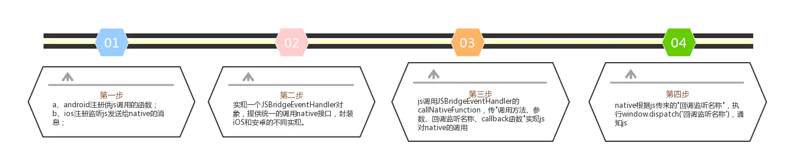
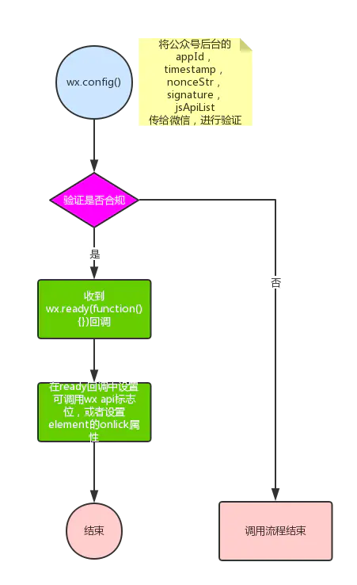
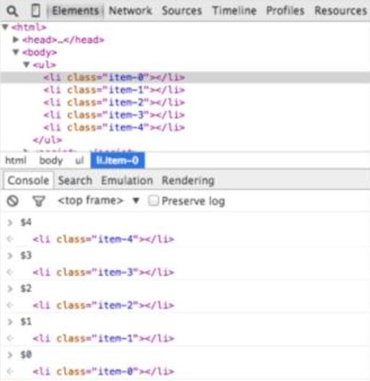
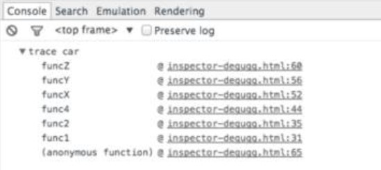
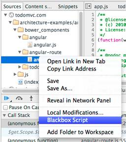
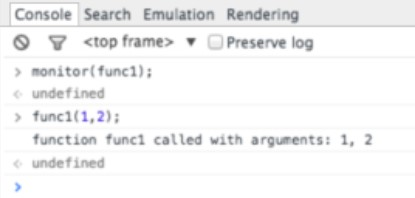
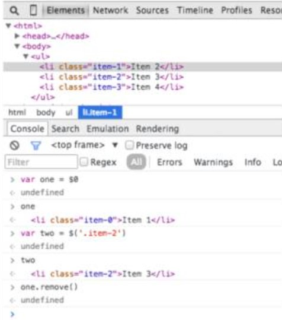
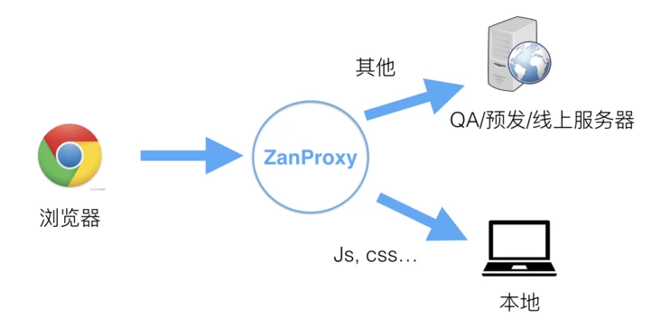

# **移动端开发调试入门**

### **目录**
* 1.基础概念
* 2.原理
* 3.调试技巧

## **一、基础概念**
### **1 WebView**
**（1）定义**

**WebView，直译是网页视图，是一个基于 webkit 内核的，用于显示网页的控件，具备渲染 Web 页面的功能。** Android 的 Webview 在低版本和高版本采用了不同的 webkit 版本内核，4.4后直接使用了 Chrome。

WebView 可以内嵌在移动端，实现前端的混合式开发，大多数混合式开发框架都是基于 WebView 模式进行二次开发的，比如，uni-app、Hybrid app 等。

**（2）作用**
* 显示和渲染 Web 页面
* 直接使用 html 文件（网络上或本地 assets 中）作布局
* 可和 JavaScript 交互调用
* 除了具有一般 View 的属性和设置外，还可以对 url 请求、页面加载、渲染、页面交互进行强大的处理。

### **2 JSBridge**
**（1）问题**

近些年，移动端普及化越来越高，开发过程中选用 Native 还是 H5 一直是热门话题。Native 和 H5 都有着各自的优缺点，为了满足业务的需要，公司实际项目的开发过程中往往会融合两者进行 Hybrid 开发。Native 和 H5 分处两地，看起来无法联系，那么如何才能让双方协同实现功能呢？


<br/>

**（2）定义**

**JSBridge 是一种 JS 实现的 Bridge，连接着桥两端的 Native 和 H5。它在 APP 内方便地让 Native 调用 JS，JS 调用 Native ，是双向通信的通道。** JSBridge 主要提供了 JS 调用 Native 代码的能力，实现原生功能如查看本地相册、打开摄像头、指纹支付等。

**（3）作用**

在开发中，为了追求开发的效率以及移植的便利性，一些展示性强的页面我们会偏向于使用H5 来完成，功能性强的页面我们会偏向于使用 Native 来完成，而一旦使用了 H5，为了在 H5 中尽可能的得到 Native 的体验，我们 Native 层需要暴露一些方法给 JS 调用，比如，弹 Toast 提醒，弹 Dialog，分享等等，有时候甚至把 H5 的网络请求放着 Native 去完成。

JSBridge 就像其名称中的『Bridge』的意义一样，是 Native 和非 Native 之间的桥梁，它的核心是 构建 Native 和非 Native 间消息通信的通道，而且是双向通信的通道。
* JS 向 Native 发送消息：调用相关功能、通知 Native 当前 JS 的相关状态等。
* Native 向 JS 发送消息：回溯调用结果、消息推送、通知 JS 当前 Native 的状态等。

**（4）双向通信**

**a. JS 调用 Native**

主要有**拦截 URL Scheme 、重写 prompt 、注入 API** 等方法。

🌱 **拦截 URL Scheme**

**Scheme 相关**

URL SCHEME是一种类似于url的链接，是为了方便app直接互相调用设计的，形式和普通的 url 近似，主要区别是 protocol 和 host 一般是自定义的，例如: `qunarhy://hy/url?url=ymfe.tech，protocol` 是 qunarhy，host 则是 hy。

拦截 URL SCHEME 的主要流程是：Web 端通过某种方式（例如 iframe.src）发送 URL Scheme 请求，之后 Native 拦截到请求并根据 URL SCHEME（包括所带的参数）进行相关操作。

访问协议地址，目前有3种方式，以打开某APP客户端登录页为例：
* 通过 a 标签打开，点击标签时启动 APP
```
<a href="xxxx:login">打开登录页</a>
```
* 通过 iframe 打开，设置 iframe.src 即会启动
```
<iframe src="xxxx:login"></iframe>
```
* 直接通过 window.location 进行跳转
```
window.location.href= "xxxx:login";
```

补充：微信是一个特殊的存在，对于 schema，微信会做出来拦截，导致通过 schema 协议无法唤起 APP。想要在微信中唤起 APP，需要通过微信 JS-SDK 提供的接口进行唤起 APP，目前微信并未在其开放平台上说明其接口，只有部分在微信白名单中的应用程序可使用对应的接口进行唤起 APP。

**调用相关**

Android 和 iOS 都可以通过拦截 URL Scheme 并解析 scheme 来决定是否进行对应的 Native 代码逻辑处理。

Android 中 Webview 提供了 shouldOverrideUrlLoading 方法来提供给 Native 拦截 H5 发送的 URL Scheme 请求。
```
public class CustomWebViewClient extends WebViewClient {
    @Override
    public boolean shouldOverrideUrlLoading(WebView view, String url) {
      ......
      // 场景一： 拦截请求、接收 scheme
        if (url.equals("xxx")) {

            // handle
            ...
            // callback
            view.loadUrl("javascript:setAllContent(" + json + ");")
            return true;
        }
        return super.shouldOverrideUrlLoading(url);
     }
}
```
<br/>

iOS 的 WKWebview 可以根据拦截到的 URL Scheme 和对应的参数执行相关的操作。
```
- (void)webView:(WKWebView *)webView decidePolicyForNavigationAction:(WKNavigationAction *)navigationAction decisionHandler:(void (^)(WKNavigationActionPolicy))decisionHandler{
    if ([navigationAction.request.URL.absoluteString hasPrefix:@"xxx"]) {
        [[UIApplication sharedApplication] openURL:navigationAction.request.URL];
    }
    decisionHandler(WKNavigationActionPolicyAllow);
}
``` 

**【总结】**

**优点**：不存在漏洞问题、使用灵活，可以实现 H5 和 Native 页面的无缝切换。例如在某一页面需要快速上线的情况下，先开发出 H5 页面。某一链接填写的是 H5 链接，在对应的 Native 页面开发完成前先跳转至 H5 页面，待 Native 页面开发完后再进行拦截，跳转至 Native 页面，此时 H5 的链接无需进行修改。

**缺点**：使用 iframe.src 来发送 URL Scheme 需要对 URL 的长度作控制，使用复杂，速度较慢。

<br/>

🌱 **重写 prompt 等原生 JS 方法**

**Android**

Android 4.2 之前注入对象的接口是 addJavascriptInterface ，但是由于安全原因慢慢不被使用。一般会通过修改浏览器的部分 Window 对象的方法来完成操作。主要是拦截 alert、confirm、prompt、console.log 四个方法，分别被 Webview 的 onJsAlert、onJsConfirm、onConsoleMessage、onJsPrompt 监听。其中 onJsPrompt 监听的代码如下：
```
public boolean onJsPrompt(WebView view, String origin, String message, String defaultValue, final JsPromptResult result) {
  String handledRet = parentEngine.bridge.promptOnJsPrompt(origin, message,             defaultValue);
  xxx;
  return true;
}
```

**iOS**

iOS 由于安全机制， WKWebView 对 alert、confirm、prompt 等方法做了拦截，如果通过此方式进行 Native 与 JS 交互，需要实现 WKWebView 的三个 WKUIDelegate 代理方法。代码示例如下：
```
-(void)webView:(WKWebView *)webView runJavaScriptAlertPanelWithMessage:(NSString *)message initiatedByFrame:(WKFrameInfo *)frame completionHandler:(void (^)(void))completionHandler{

    UIAlertController *alertController = [UIAlertController                    alertControllerWithTitle:nil message:message?:@"" preferredStyle:UIAlertControllerStyleAlert];

    [alertController addAction:([UIAlertAction actionWithTitle:@"确认" style:UIAlertActionStyleDefault handler:^(UIAlertAction * _Nonnull action) {
        completionHandler();
    }])];

    [self presentViewController:alertController animated:YES completion:nil];

}
```
**【总结】**

使用该方式时，可以与 Android 和 iOS 约定好使用传参的格式，这样 H5 可以无需识别客户端，传入不同参数直接调用 Native 即可。剩下的交给客户端自己去拦截相同的方法，识别相同的参数，进行自己的处理逻辑即可实现多端表现一致。另外，如果能与 Native 确定好方法名、传参等调用的协议规范，这样其它格式的 prompt 等方法是不会被识别的，能起到隔离的作用。
<br/>

🌱 **注入 API**

基于 Webview 提供的能力，我们可以向 Window 上注入对象或方法。JS 通过这个对象或方法进行调用时，执行对应的逻辑操作，可以直接调用 Native 的方法。使用该方式时，JS 需要等到 Native 执行完对应的逻辑后才能进行回调里面的操作。

Android 的 Webview 提供了 addJavascriptInterface 方法，支持 Android 4.2 及以上系统。
```
gpcWebView.addJavascriptInterface(new JavaScriptInterface(), 'nativeApiBridge'); 
public class JavaScriptInterface {
    Context mContext;

  JavaScriptInterface(Context c) {
    mContext = c;
  }

  public void share(String webMessage){            
    // Native 逻辑
  }
}
```
```
// JS 调用
window.NativeApi.share(xxx);
```
iOS 的 UIWebview 提供了 JavaScriptScore 方法，支持 iOS 7.0 及以上系统。WKWebview 提供了 window.webkit.messageHandlers 方法，支持 iOS 8.0 及以上系统。UIWebview 在几年前常用，目前已不常见。
以下为创建 WKWebViewConfiguration 和 创建 WKWebView 示例：
```
WKWebViewConfiguration *configuration = [[WKWebViewConfiguration alloc] init];
WKPreferences *preferences = [WKPreferences new];
preferences.javaScriptCanOpenWindowsAutomatically = YES;
preferences.minimumFontSize = 40.0;
configuration.preferences = preferences;


- (void)viewWillAppear:(BOOL)animated
{
    [super viewWillAppear:animated];
    [self.webView.configuration.userContentController addScriptMessageHandler:self name:@"share"];
      [self.webView.configuration.userContentController addScriptMessageHandler:self name:@"pickImage"];
}
- (void)viewWillDisappear:(BOOL)animated
{
    [super viewWillDisappear:animated];
    [self.webView.configuration.userContentController     removeScriptMessageHandlerForName:@"share"];
    [self.webView.configuration.userContentController removeScriptMessageHandlerForName:@"pickImage"];
}
```
```
// 调用
window.webkit.messageHandlers.share.postMessage(xxx);
```

**b. Native 调用 JS**

Native 调用 JS 比较简单，**只要 H5 将 JS 方法暴露在 Window 上给 Native 调用即可。**

Android 中主要有两种方式实现。
* 在 4.4 以前，通过 loadUrl 方法，执行一段 JS 代码来实现。
* 在 4.4 以后，可以使用 evaluateJavascript 方法实现。

loadUrl 方法使用起来方便简洁，但是效率低无法获得返回结果且调用的时候会刷新 WebView 。

evaluateJavascript 方法效率高获取返回值方便，调用时候不刷新 WebView，但是只支持 Android 4.4+。相关代码如下：
```
webView.loadUrl("javascript:" + javaScriptString);
webView.evaluateJavascript(javaScriptString, new ValueCallback<String>() {
  @Override
  public void onReceiveValue(String value){
    xxx
  }
});
```

iOS 在 WKWebview 中可以通过 evaluateJavaScript:javaScriptString 来实现，支持 iOS 8.0 及以上系统。
```
// swift
func evaluateJavaScript(_ javaScriptString: String, 
    completionHandler: ((Any?, Error?) -> Void)? = nil)
// javaScriptString 需要调用的 JS 代码
// completionHandler 执行后的回调

// objective-c
[jsContext evaluateJavaScript:@"ZcyJsBridge(ev, data)"]
```

**（5）引用**

**a. 由 JavaScript 端引用**

采用本地引入 npm 包的方式进行调用。直接与 JavaScript 一起执行。与由 Native 端注入正好相反。

优点：JavaScript 端可以确定 JSBridge 的存在，直接调用即可。

缺点：如果桥的实现方式有更改，JSBridge 需要兼容多版本的 Native Bridge 或者 Native Bridge 兼容多版本的 JSBridge，维护成本高。

**b. 由 Native 端进行注入**

注入方式和 Native 调用 JavaScript 类似，直接执行桥的全部代码。

优点：桥的版本很容易与 Native 保持一致，Native 端不用对不同版本的 JSBridge 进行兼容。

缺点：注入时机不确定，需要实现注入失败后重试的机制，保证注入的成功率，同时 JavaScript 端在调用接口时，需要优先判断 JSBridge 是否已经注入成功。

### **3 JS-SDK**
**（1）定义**

**JS-SDK 为应用提供了调用原生的能力，帮助开发者高效使用定位等手机系统的能力。**

JSBridge 做得好的一个典型就是微信，微信给开发者提供了 JS-SDK，该 SDK 中暴露了很多微信 Native 层的方法，比如支付，定位等。通过使用微信 JS-SDK，网页开发者可借助微信高效地使用拍照、选图、语音、位置等手机系统的能力，同时可以直接使用微信分享、扫一扫、卡券、支付等微信特有的能力，为微信用户提供更优质的网页体验。

**（2）作用**
* 抹平 JSBridge 的平台实现差异
* 对齐端能力，内部消化版本差异
* sdk 封装后的代码更加符合前端习惯
* 权限控制、鉴权、对外开放，实现生态建设

**（3）使用**
* [微信 JS-SDK 官方教程](https://developers.weixin.qq.com/doc/offiaccount/OA_Web_Apps/JS-SDK.html)
* [JS-SDK 的微信分享接入](https://segmentfault.com/a/1190000041181044)

### **4 WebView DevTools**
**（1）定义**

一个调试原生 Android 应用程序中的 WebView 内容的工具。

**（2）使用**

**a. 在 Android 中设置允许调试**
* 在加载 WebView 的 Activity 的 onCreate 中添加代码。该步骤是开启 WebView 的调试模式，不开启则获取不到。
```
WebView.setWebContentsDebuggingEnabled(true);
```
* 启用手机开发者模式
```
【设置】--【更多设置】--【关于手机】--【软件版本号】-- 连点七次 -- 返回更多设置启用开发者选项
```
* 启用手机 USB 调试
```
【设置】--【更多设置】--【开发者选项】--【USB调试】
```
**b. 打开浏览器手机调试工具**

* 将安卓手机和电脑使用 USB 数据线相连
* 打开浏览器调试工具开始调试
  - Chrome：[chrome://inspect/#devices](chrome://inspect/#devices)
  - Edge：[edge://inspect/#devices](edge://inspect/#devices)
* 点击 inspect 开始调试


### **5 adb**
* 详见 [mac 从零配置前端开发环境](https://github.com/sevenxki/summer-internship/blob/main/Mac/mac%20%E4%BB%8E%E9%9B%B6%E9%85%8D%E7%BD%AE%E5%89%8D%E7%AB%AF%E5%BC%80%E5%8F%91%E7%8E%AF%E5%A2%83.md#29-adb) 


## **二、原理**
### **1 JS 与 Native 交互流程**
<br/>

<br/>

```
// 举例
window.JSBridgeEventHandler.callNativeFunction('propose',"hello Native，你好",'proposeCallback',onNotify);

// Native 将执行 propose 方法，并收到传来的"hello Native，你好"，
// 并通过 window.dispatchEvent('proposeCallback')，通过 js 的 onNotify 方法得到调用。
```

### **2 微信 JSBridge 实现方式分析**
<br/>

<br/>

## **三、调试技巧**
### **1 纯网页调试**
#### **1.1 Chrome 控制台调试**

利用开发者工具提供的一些方法，可以有效帮助定位日常开发中遇到的问题。

**（1）debugger;**

‘debugger’ 是简单暴力的调试工具，只要把它写到代码里，Chrome 运行的时候就会自动自动停在那。甚至可以用条件语句把它包裹起来，这样就可以在需要的时候才执行它。
```
if (xxx) {
    debugger;
}
```

**（2）把 objects 输出成表格**

有时候可能有一堆对象需要查看。这时可以用 `console.log` 把每一个对象都输出出来，你也可以用 `console.table` 语句把它们直接输出为一个表格。
```
var animals = [
    { animal: 'Horse', name: 'Henry', age: 43 },
    { animal: 'Dog', name: 'Fred', age: 13 },
    { animal: 'Cat', name: 'Frodo', age: 18 }
];

console.table(animals);
```

**（3）试遍所有的尺寸**

在移动端界面开发中，在 Chrome 浏览器进入检查面板点击 ‘切换设备模式’ 按钮，这样就可以调整视窗的大小了。

**（4）快速定位 DOM 元素**

在元素面板上标记一个 DOM 元素并在 console 中使用它。Chrome Inspector 的历史记录保存最近的五个元素，最后被标记的元素记为 $0，倒数第二个被标记的记为 $1，以此类推。

如果你像下面那样把元素按顺序标记为 ‘item-4′, ‘item-3’, ‘item-2’, ‘item-1’, ‘item-0’ ，你就可以在 concole 中获取到 DOM 节点:


<br/>

**（5）用 `console.time()` 和 `console.timeEnd()` 测试循环耗时**

当想知道某些代码的执行时间的时候这个工具将会非常有用，特别是当定位很耗时的循环的时候。甚至可以通过标签来设置多个 timer。
```
console.time('Timer1');
var items = [];
for(var i = 0; i < 100000; i++){
   items.push({index: i});
}
console.timeEnd('Timer1');
```

**（6）获取函数的堆栈轨迹信息**

因为 JavaScript 不是一个很结构化的语言，有时候很难完整的了解到底发生了什么以及什么时候发生的。 这个时候就轮到 console.trace（在终端的话就只有 trace ）出场来调试 JavaScript了 。

假设现在想看 car 实例调用 funcZ 函数的完整堆栈轨迹信息:
```
var car; 
var func1 = function() {
	func2();
} 

var func2 = function() {
	func4();
}

var func3 = function() {
} 

var func4 = function() {
	car = new Car();
	car.funcX();
}

var Car = function() {
	this.brand = ‘volvo’;
	this.color = ‘red’;
	this.funcX = function() {
		this.funcY();
	}
	this.funcY = function() {
		this.funcZ();
	}
 	this.funcZ = function() {
		console.trace(‘trace car’)
	}
} 

func1();
```

看到 func1 调用了 func2, func2 又调用了 func4。func4 创建了 Car 的实例，然后调用了方法 car.funcX，等等。尽管你感觉你对自己的脚本代码非常了解，这种分析依然是有用的。比如你想优化你的代码。获取到堆栈轨迹信息和一个所有相关函数的列表。每一行都是可点击的，你可以在他们中间前后穿梭。


<br/>

**（7）格式化代码使调试 JavaScript 变得容易**

Chrome 可以格式化 JavaScript 文件，使之易读。格式化出来的代码在可读性上可能不如源代码 —— 但至少你可以观察到发生的错误。点击源代码查看器下面的美化代码按钮 {} 即可。

**（8）快速找到调试函数**

在函数中设置断点通常采用以下两种方法
* 在查看器中找到某行代码并在此添加断点
* 在脚本中添加 debugger

这两种方法都必须在文件中找到需要调试的那一行。

使用控制台是不太常见的方法。在控制台中使用 `debug(funcName)`，代码会在停止在进入这里指定的函数时。
这个操作很快，但它不能用于局部函数或匿名函数。不过如果不是这两种情况下，这可能是调试函数最快的方法。（注意：这里并不是在调用 console.debug 函数）
```
var func1 = function() {
	func2();
}

var Car = function() {
	this.funcX = function() {
		this.funcY();
	}
	this.funcY = function() {
		this.funcZ();
	}
}
var car = new Car();
```
在控制台中输入 `debug(car.funcY)`，脚本会在调试模式下，进入 `car.funcY` 的时候停止运行

**（9）屏蔽不相关代码**

如今，经常在应用中引入多个库或框架。其中大多数都经过良好的测试且相对没有缺陷。但是，调试器仍然会进入与此调试任务无关的文件。解决方案是将不需要调试的脚本屏蔽掉。当然这也可以包括你自己的脚本。[更多相关](http://raygun.com/blog/javascript-debugging-with-black-box/)


<br/>

**（10）在复杂的调试过程中寻找重点**

在更复杂的调试中，我们有时需要输出很多行。你可以做的事情就是保持良好的输出结构，使用更多控制台函数，例如 `console.log`，`console.debug`，`console.warn`，`console.info`，`console.error` 等等。然后，你可以在控制台中快速浏览。但有时候，某些 JavaScrip 调试信息并不是你需要的。

现在，可以自己美化调试信息了。在调试JavaScript时，可以使用CSS并自定义控制台信息.

例如：
在 `console.log()` 中， 可以用 %s 设置字符串，%i 设置数字，%c 设置自定义样式等等，还有很多更好的 `console.log()` 使用方法。 如果使用的是单页应用框架，可以为视图（view）消息创建一个样式，为模型（models），集合（collections），控制器（controllers）等创建另一个样式。也许还可以像 wlog，clog 和 mlog 一样发挥你的想象力！

```
console.todo = function(msg) {
    console.log(‘ % c % s % s % s‘, ‘color: yellow; background - color: black;’, ‘–‘, msg, ‘–‘);
}

console.important = function(msg) {
    console.log(‘ % c % s % s % s’, ‘color: brown; font - weight: bold; text - decoration: underline;’, ‘–‘, msg, ‘–‘);
}

// test
console.todo(“This is something that’ s need to be fixed”);
console.important(‘This is an important message’);
```

**（11）查看具体的函数调用和它的参数**

在 Chrome 浏览器的控制台（console）中，你会把你的注意力集中在具体的函数上。每次这个函数被调用，它的值就会被记录下来。


<br/>

这是查看将哪些参数传递到函数的一种很好的方法。

**（12）在控制台中快速访问元素**

在控制台中执行 querySelector 一种更快的方法是使用美元符。`$(‘css-selector’)` 将会返回第一个匹配的 CSS 选择器。`$$(‘css-selector’)` 将会返回所有。如果你使用一个元素超过一次，它就值得被作为一个变量。


<br/>

**（13）Postman 很棒（但 Firefox 更快）**

很多开发人员都使用 Postman 来处理 Ajax 请求。Postman 真不错，但每次都需要打开新的浏览器窗口，新写一个请求对象来测试。这确实有点儿烦人。

有时候直接使用在用的浏览器会更容易。

这样的话，如果你想请求一个通过密码保证安全的页面时，就不再需要担心验证 Cookie 的问题。这就是 Firefox 中编辑并重新发送请求的方式。

打开探查器并进入网络页面，右键单击要处理的请求，选择编辑并重新发送。现在你想怎么改就怎么改。可以修改头信息，也可以编辑参数，然后点击重新发送即可。

现在我发送了两次同一个请求，但使用了不同的参数：


<br/>

**（14）节点变化时中断**

DOM 是个有趣的东西。有时候它发生了变化，但你却并不知道为什么会这样。不过，如果你需要调试 JavaScript，Chrome 可以在 DOM 元素发生变化的时候暂停处理。你甚至可以监控它的属性。在 Chrome 探查器上，右键点击某个元素，并选择中断（Break on）选项来使用。

#### **1.2 Web Inspector Remote**

[Web Inspector Remote](https://people.apache.org/~pmuellr/weinre/docs/latest/Home.html) 是一个远程调试工具，又称 weinre。需要搭建一个 weinre 的服务器，然后被调试的页面中引入一个 JS，就可以进行远程调试。有点类似 Chrome 开发者工具的调试，不过 weinre 比较适用于调试 CSS，不太合适调试 JS，有些 JS 的错误往往不能报出来。

#### **1.3 Vconsole**

[Vconsole](https://github.com/Tencent/vConsole) 是腾讯微信团队出品的一个前端调试工具，功能很强大，可以看到页面日志、代理信息、网络请求、页面元素、还有 cookie、localStorage 等。

使用方式
* npm安装
```
npm install vconsole
```
* 或直接引入压缩后的 JS
```
<script src="path/to/vconsole.min.js"></script>
<script>
// init vConsole
var vConsole = new VConsole();
console.log('Hello world');
</script>
```

#### **1.4 onerror 捕获异常**

监听 window 的 onerror 事件可以捕获全局的一些 JS 异常，不过只适用于内联 JS 或者同域下的 JS，否则就需要 crossorigin 参数和远程资源服务器的支持。

onerror 捕获异常比较适用于产品上线后的监控使用，通过收集错误信息，上报到监控服务器，并设置告警条件，可以有效及时地发现线上的错误。

**【总结】**
* 在开发阶段，我们使用 Chrome 开发者工具进行移动端的模拟开发；
* 在测试阶段，我们使用 weinre 和 Vconsole 定位具体的终端问题；
* 上线之后，我们监控 window 的 onerror 事件，及时发现线上用户实际使用过程产生的一些异常。


### **2 客户端调试**
#### **2.1 微信端调试**

微信端调试最好的当然是微信自家的产品——微信 Web 开发者工具。这个工具在扫一扫登录之后，就可以模拟出微信客户端的环境，可以调试微信分享API、支付API等一系列客户端特定的功能。

#### **2.2 安卓端 USB 调试**
* 连接 USB
* 开启安卓的调试模式
* 若为谷歌访问 chrome://inspect
* 勾选 Discover USB devices
* 选取要调试的网页

#### **2.3 iOS 端 USB 调试**
* 连接 USB
* 手机上 Settings -> Safari -> Advanced，启用 Web Inspector
* 手机上打开 Web 页面
* Mac 上 Safari 中点 Develop -> 设备名 -> 选择网页
* 弹出 Web Inspector 进行调试

### **3 代理调试**
#### **3.1 https 抓包**

#### **3.2 fiddler代理本地文件**

#### **3.3 DNS访问本地服务器**

#### **3.4 利用 ZanProxy 实现用本地代码对线上页面的调试**

**（1）原因**

在前端开发中，我们常常会碰到以下几个场景：
* 对于前端开发者来说，我们需要一个工具能让我们直接用本地的前端代码调试QA环境、预发环境、甚至线上的页面。
* 我们需要在开发的时候需要快速切换环境，修改系统的 host 会有浏览器的 DNS 缓存，常常需要手动清除。所以我们需要一个工具让我们秒切host，不用等待 。
* 前后端并行开发的时候，开发中接口的数据通常需要 mock。通过nginx反向代理到mock平台步骤繁琐，配置麻烦，对新手及其不友好。 所以我们需要一个工具能轻松 mock 接口的数据。

**（2）定义**

ZanProxy 是一个基于 Node.js 的代理服务器。它专注于帮助前端开发提高开发效率。
* 官网：[https://youzan.github.io/zan-proxy/](https://youzan.github.io/zan-proxy/)
* Github：[https://github.com/youzan/zan-proxy](https://github.com/youzan/zan-proxy)
* 使用文档：[https://youzan.github.io/zan-proxy/book/](https://youzan.github.io/zan-proxy/book/)


<br/>

<br/>

### **参考资料**
* [通过 H5 页面唤 Native 客户端](https://www.npmjs.com/package/tool-callapp?activeTab=readme)
* [小白必看，JSBridge 初探](https://www.zoo.team/article/jsbridge)
* [如何在浏览器中调试 Android 的 WebView](https://juejin.cn/post/6987566217267511310)
* [JS 与 Native 通讯原理分析及微信 JS-SDK 实现流程](https://www.jianshu.com/p/960b030f5896)
* [移动端开发调试技巧](https://futu.im/article/how-to-debug-webview/)
* [ZanProxy —— 本地代码调试线上页面，环境再也不是问题](https://segmentfault.com/a/1190000015377089)
